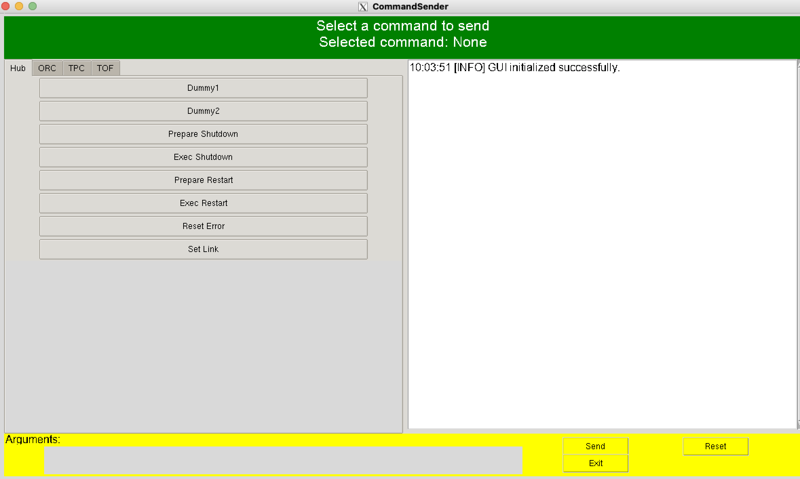
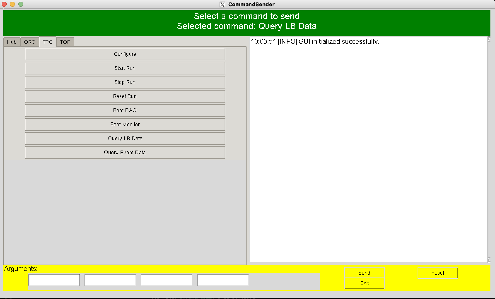
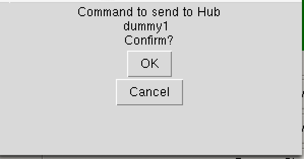

# How to Send Commands from the Ground System

## Preparation

The command sending software is different from the main software. You need to build it separately. See [Installation](../Installation.md).

Also, you need to install python library tkinter to use GUI software.
You can install it via pip:

```zsh
pip install tk
```

If you are using GSE1 (our ground computer). tkinter is already installed. To activate the python environment in GSE1, run:

```zsh
conda activate command
```

To control GUI software from SSH session, you need to enable X11 forwarding.
You can do it by adding `-X` option to your ssh command:

```zsh
ssh -X user@your_ground_computer_address
```

## Running Command Sender

Then, go to the command sender directory:

```zsh
cd (source)/(to)/(pGramsFC)/command_sender/
python3 command_sender.py
```

This will open the command sender GUI.



### Using Command Sender GUI

You can choose the subsystem you want to send command to from the "Subsystem" dropdown menu.

Then, select the command you want to send from the "Command" dropdown menu. You can check selected command from "Selected Command".



After selecting the command, you can input the parameters required for the command in the "Arguments" section.

Click the "Send" button to send the command to the selected subsystem.

Confirmation message will be displayed, and choose "OK" to proceed.



After sending the command, the log window will display the result of the command sending.

```
10:11:21 [INFO] Command executed successfully:
Host: localhost
Port: 1883
Username: pgrams_user
Password: pgrams_user
Length sent: 0
Command sent to topic: Hub
Subsystem: HUB
Command name: dummy1
Arguments: 
```
