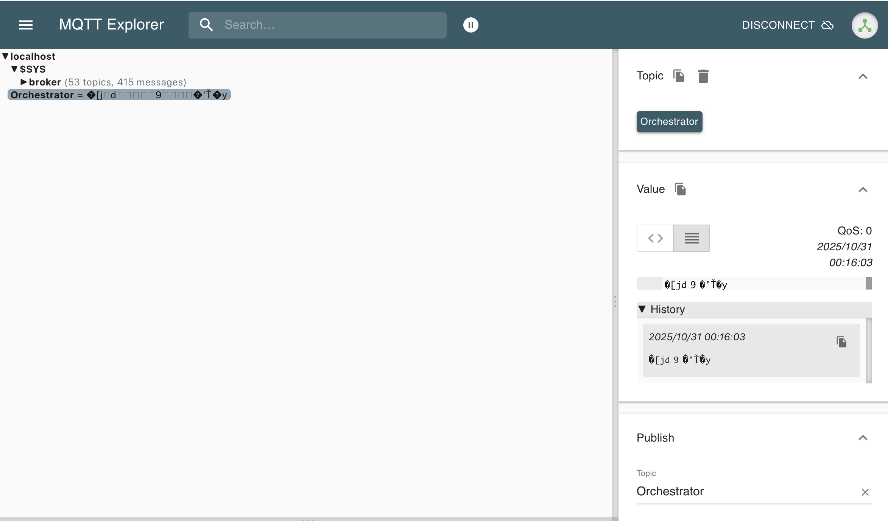

# Installation of pGramsFC

## Prerequisite Software

### Common

- ANLNext
  - Modular analysis framework developed by Hiro Odaka
  - git repository: <https://github.com/odakahirokazu/anlnext>
- CMake
- Boost
- A C++ compiler supporting C++17
- ruby (version 3.0 or later)
- SWIG
- mosquitto (<https://mosquitto.org/>)
- pGRAMSBalloon (<https:/github.com/NevisNeutrinos/pGRAMSBalloon>)

### For Onboard System

- versaAPI (for controlling Digital IO and SPI)
- d2xx (for FT232H)

### For Ground System

- MySQL
- libmysqlconncpp

## CMake options

- GB_USE_PGRAMSBALLOON_PATH: Path for pGRAMSBalloon directory
- GB_USE_BAYCAT_SPI: Switch for Baycat SPI (default: ON)
- GB_USE_USE_FT232H: Switch for FT232H SPI (default: ON)
- GB_USE_MYSQL: Switch for MySQL (default: OFF)

## Procedure

### Common

1. Install Boost, CMake, ruby, SWIG, and mosquitto.

   `sudo apt install libboost-all-dev ruby-3.0-dev swig mosquitto` (ubuntu/debian)

   `brew install boost ruby swig mosquitto` (Mac, via Homebrew)

   Note: For installing mosquitto into ubuntu/debian, you may need to build from source instead of using apt. Mosquitto library on the hub computer is installed by building from source.

2. Download pGRAMSBalloon

    `git clone https:/github.com/NevisNeutrinos/pGRAMSBalloon`

    You don't have to build or install it.

3. Install ANLNext

   `git clone https://github.com/odakahirokazu/anlnext.git`

   `cd anlnext`

   `mkdir build && cd build`

   `cmake ..` (NOTE: If you encounter errors due to missing ruby config path, specify it by `-DRUBY_CONFIG_FILE_DIR`. For linux, it is usually `/usr/include/(architecture)/ruby-(version)`.)

   `make`

   `make install`

    If you installed ANL Next into the $HOME directory (default destination), you need to set the following environment variables:
    (example for bash/zsh)

    `export RUBYLIB=${HOME}/lib/ruby:${RUBYLIB}`

    Otherwise, you need to set the following environment variables:

    `export ANLNEXT_INSTALL=/path/to/install`

    `export RUBYLIB=${ANLNEXT_INSTALL}/lib/ruby:${RUBYLIB}`

    In addition, Mac users before El Capitan may need to set:

    `export DYLD_LIBRARY_PATH=${ANLNEXT_INSTALL}/lib:${DYLD_LIBRARY_PATH}`

    Or Linux users may need this:

    `export LD_LIBRARY_PATH=${ANLNEXT_INSTALL}/lib:${LD_LIBRARY_PATH}`

4. Check ANLNext installation

    `cd (source)/(to)/(ANLNext)/examples/simple_loop`

    `mkdir build && cd build`

    `cmake ..` (NOTE: specify the installation prefix if not using default ($HOME/lib) by CMAKE_INSTALL_PREFIX option)

    `make`

    `make install`

    `cd ../run`

    `./run_simple_loop.rb`

    If everything is OK, you will see the output like below:

    ```plain
    
    ######################################################
    #                                                    #
    #          ANL Next Data Analysis Framework          #
    #                                                    #
    #    version:  2.02.02                               #
    #    author: Hirokazu Odaka                          #
    #    URL: https://github.com/odakahirokazu/ANLNext   #
    #                                                    #
    ######################################################


            **************************************
            ****          Definition          ****
            **************************************


    ANLManager: starting <define> routine.


    ANLManager: <define> routine successfully done.
    
                            .
                            .
                            .
    
    <End Analysis>   | Time: 2025-10-24 01:00:54 +0900

    Analyze() returned AS_QUIT.

        **************************************
        ****         Finalization         ****
        **************************************

    ANLManager: starting <finalize> routine.
   
    ANLManager: <finalize> routine successfully done.
    ```

### For onboard system

1. Install additional prerequisite software

   #### Installing versaAPI

    Download source code from the website of Baycat and run the `vl_install.sh`

    Note: This software needs 3 kernel modules, which is installed when running `vl_install.sh`. However, once kernel version is updated, the modules would not be loaded. To load it forever, you should register dkms system.

   #### Installing libd2xx

    Download source code from FTDI website and place the library file to somewhere.

2. Install GRAMSBalloon

    `git clone https://github.com/STA205233/pGramsFC`

    `cd pGramsFC`

    `mkdir build && cd build`

    `cmake ../onboard -DGB_PGRAMSBALLOON_PATH=~/software/pGRAMSBalloon`

    You have to specify pGRAMSBalloon directory.

    (NOTE: specify the installation prefix if not using default ($HOME/lib) by CMAKE_INSTALL_PREFIX option)

    `make`

    `make install`

3. Check GRAMSBalloon installation
    <a name="check_gramsballoon"></a>

    Before running the example, you need to copy `settings/pGRAMS.sh` to the home directory and modify it to specify the information by environment variables:

    ```zsh
    export ANLNEXT_INSTALL="/home/user"
    export RUBYLIB=${ANLNEXT_INSTALL}/lib/ruby:${RUBYLIB}
    export LD_LIBRARY_PATH="${LD_LIBRARY_PATH}:/usr/local/lib/"
    export LD_LIBRARY_PATH=${ANLNEXT_INSTALL}/lib:${LD_LIBRARY_PATH}

    export PGRAMS_MOSQUITTO_HOST="localhost"
    export PGRAMS_MOSQUITTO_USER="user"
    export PGRAMS_MOSQUITTO_PASSWD="password"
    export PGRAMS_MOSQUITTO_PORT="1883"
    ```

    NOTE: To use this software as a service, this file is used as an environment file for systemd. Even if the variable contains environment variables, they may not be expanded properly. For example, if you run it as a system service, ${HOME} would be expanded to /root/, not /home/user/.

    And you should write the following line to `${HOME}/.bashrc` to load these setting:

    ```zsh
    source ${HOME}$/pgrams.sh
    ```

    Also, you have to run mosquitto broker somewhere (locally or on another PC).

    Example: `brew services start mosquitto` (Mac, via Homebrew)

    Then, go to the examples directory:

    `cd (source)/(to)/(pGramsFC)/examples/`

   #### DAQ Computer communication example

    Before running this example, you may need to change the serial port setting by modifying [network.cfg](../settings/network.cfg)

    This file is written like below:

    ```ini
    [Orchestrator]// Subsystem name

    ip="localhost" // IP address of the server (Usually localhost)
    telport=50000 // Telemetry port
    comport=50001 // Command port
    comtopic="Orchestrator" // Command topic
    teltopic="Orchestrator_Telemetry" // Telemetry topic
    iridiumteltopic="Orchestrator_Iridium_Telemetry" // Iridium telemetry topic
    ```

    And you have to specify subsystem which you want to enable in `DAQ_Com_communication.rb`. Specified subsystem in network.cfg should be same as this.

    ```ruby
    subsystems = ["Orchestrator", ] # Specify subsystems to enable
    ```

    And Run ID information is written and read from `~/settings/run_id/run_id_onboard.txt` by default. You may need to create this file before running the example. (You can change this path by modifying `DAQ_com_communication.rb` in line 29.)

    Then, run the example:

    `cd DAQ_com_communication`

    `./DAQ_com_communication.rb`

4. Register the software as a service (optional)

    `service/install.sh` is a script for registration this as a service. You should check the parameters in the script. And run it with sudo.

    To run it, just type this:

    ```zsh
    sudo systemctl start pGramsFC.service
    ```

    And type this to check the status:

    ```zsh
    systemctl status pGramsFC.service
    ```

### For ground system

1. Install libmysqlconncpp

2. Install GRAMSBalloon

    `git clone https://github.com/STA205233/pGramsFC`

    `cd pGramsFC`

    `mkdir build && cd build`

    `cmake ../onboard -DGB_PGRAMSBALLOON_PATH=~/software/pGRAMSBalloon -DGB_USE_BAYCAT_SPI=OFF -DGB_USE_FT232H=OFF -DGB_USE_MYSQL=ON`

    You have to specify pGRAMSBalloon directory.

    (NOTE: specify the installation prefix if not using default ($HOME/lib) by CMAKE_INSTALL_PREFIX option)

    `make`

    `make install`

   #### Interpret Telemetry example

      Before running this example, you may need to change the mosquitto broker information by modifying `pGramsFC/settings/network.cfg` (See above).

      Then, run the example:

      `cd interpret_telemetry`

      `./interpret_telemetry.rb`

   #### Send Command example - Raw command sending

    Command sending software is different from the main software. You need to build it separately. The software requires Boost and Mosquitto libraries.

    `cd (source)/(to)/(pGramsFC)/command_sender/`

    `mkdir build && cd build`

    `cmake ..`

    `make`

    Then, run the executable. Currently only raw command sending is supported for pGRAMS:

    `./send_command_raw (subsystem_name) (command code in decimal) (parameter1 in decimal) (parameter2 in decimal) ...`

    Subsystem name should be same as specified in [network.cfg](../settings/network.cfg). CRC and Argc are automatically calculated and added to the command.

    Example (Sending command code 0x64 (100 in decimal) with arguments 57, 2 to the Orchestrator subsystem):

    `./send_command_raw Orchestrator 100 57 2`

    NOTE: Please make sure that the MQTT broker is running and its IP address, port, username, and password are correctly set in the environment variables before running the examples.

   #### Send Command example (for ground system) - More user-friendly command sending

    (Added at 2025-12-13)
    A more user-friendly command sending software is also provided. This software allows you to send commands by specifying command name and parameters.

    Compile the software as follows (same as before):
    `cd (source)/(to)/(pGramsFC)/command_sender/`

    `mkdir build && cd build`

    `cmake ..`

    `make`

    send_command_(subsystem) executables corresponding to each subsystem are created (e.g., send_command_orc). Subsystem names are {"orc": Orchestrator, "tpc": Columbia Readout system, "tof": ToF readout, "pdu": PDU, "hub": hub computer}.
    Then, run the executable as follows:

    `./send_command_(subsystem) (command_name) (parameter1) (parameter2) ...`

    If you have MQTT-Explorer, you can monitor the topics and messages being sent and received. (The command is sent in binary format, so you may not be able to read it directly, but you can confirm that the message is being sent.)

    
